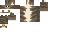
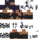
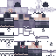
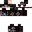
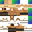
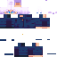
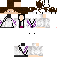

# NPC dokuları

Bütün özel NPC dokuları bu klasördedir; oyunda GitHub ham adresi üzerinden yüklenir (`SkinData` `SECURE_REMOTE_URL`). Bir dokuyu değiştirirken **yeni sürüm adı** kullan (`_v2`), aksi halde önbellek eski dokuyu gösterir. Kurallar: [docs/assets.md](../../docs/assets.md).

| Önizleme | Dosya | Karakter | Kol | Not |
|---|---|---|---|---|
|  | `camur_v2.png` | Çamur | — | Kedi |
|  | `miu_v2.png` | Miu | — | Kedi |
|  | `erwin_v1.png` | Erwin Smith | klasik | |
|  | `yoruichi_v1.png` | Yoruichi | ince | |
|  | `kakashi_v1.png` | Kakashi | klasik | |
|  | `itachi_v1.png` | Itachi | klasik | |
|  | `thorfinn_v1.png` | Thorfinn | klasik | |
|  | `kenpachi_v1.png` | Kenpachi | klasik | Orijinal 64×32 (eski biçim) idi; vanilla'nın eski-doku dönüşümüyle 64×64'e çevrildi |
|  | `gojo_v1.png` | Gojo | klasik | |
|  | `aizen_v1.png` | Aizen (yardımsever hâli) | klasik | swxff verdi. Olaydan önce kullanılır |
|  | `aizen_v2.png` | Aizen (kötü hâli) | klasik | Şimdilik `aizen_v1.png` ile aynı dosya; farklı bir doku verilirse bu dosya değiştirilir (yeni sürüm adı: `aizen_v3.png` ve `aizen.js` içindeki adres). İhanet olayında NPC bu dokuya geçer |

Yeni doku eklerken dosyayı buraya `<karakter>_v1.png` adıyla koy ve bu tabloya bir satır ekle.
