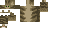

# Çamur

- **Unvan:** Kralın Kedisi
- **Tür:** Kedi (easy_npc:cat)
- **Konum:** -1045, 71, -344
- **Krallık:** [Caddy](../kingdoms/caddy.md) — kralı
- **Görevi:** —
- **Poz:** Oturuyor
- **Görünüş:** Özel doku [camur_v2.png](../../../assets/npc-skins/camur_v2.png), gerçek kedi Çamur'a göre
- **Sır:** Oyuncular onu "Kralın Kedisi" olarak bilir, ama Caddy Krallığı'nın kralı Çamur'un kendisidir.
- **İlişkiler:** Çiftçi Tobias ve Şövalye Aldric onun adamları; Miu arkadaşı

## Skin / Texture

- **Dosya:** [`assets/npc-skins/camur_v2.png`](../../../assets/npc-skins/camur_v2.png) (64×32, kedi)
- **Oyunda:** `SkinData` `SECURE_REMOTE_URL` ile bu dosyanın GitHub ham adresine bağlı; gerçek kedi Çamur'a göre çizildi.
- Kurallar ve nasıl bağlanacağı: [assets.md](../../../docs/assets.md)

## Hikâye

## Diyaloglar

