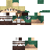

# Erwin Smith

*(Önceki adı: Şövalye Aldric. Aynı NPC, aynı konum ve işlev; ad ve görünüm değişti.)*

- **Tür:** İnsan (easy_npc:humanoid, klasik kol)
- **Konum:** -988.5, 68, -371.5 (spawn)
- **Krallık:** [Caddy](../kingdoms/caddy.md) (tarafsız, hiçbir krallığa bağlı değil)
- **Görevi:** Keşif Birliği komutanı. Maceracı rütbeli oyunculara tekrarlanmayan, kademeli zorlaşan **öldürme seferleri** verir (aşağıda). Aldric'ten kalan ticaret ("Tedarik" düğmesi) duruyor.
- **Görünüş:** Attack on Titan'daki Erwin Smith (sarı saç, Survey Corps yeşil pelerini)
- **İlişkiler:** Çamur'un adamı

## Skin / Texture

- **Dosya:** [`assets/npc-skins/erwin_v1.png`](../../../assets/npc-skins/erwin_v1.png) (64×64, insan, klasik kol)
- **Oyunda:** `SkinData` `SECURE_REMOTE_URL` ile bu dosyanın GitHub ham adresine bağlı, skin UUID'si adresin `UUID.nameUUIDFromBytes` sonucu (bkz. [assets.md](../../../docs/assets.md)).

## Hikâye

## Sefer Sistemi (Keşif Birliği)

**Şart:** `rank_maceraci`. Rütbesizlere Erwin reddeder (`erwin_ret`).

**Akış:** "Sefer istiyorum" → Erwin rütbeye uygun **3 sefer teklif eder** (sohbette tıklanır: [A] [B] [C]) → oyuncu seçer, hedefi öldürür (eylem çubuğunda sayaç) → "Rapor veriyorum" → ödül. Aynı anda tek sefer; sefer sonrası 2 dk, bırakınca 5 dk bekleme; günde en çok 6 sefer. Son 4 sefer teklifte tekrarlanmaz; teklifler 10 dk geçerli. Hedef sayısı her tekliflenişte aralıktan rastgele seçilir.

**Rütbeler (terfi):** Yeminsiz → Kül Bekçisi (3 Sis Devriyesi) → Kan Yeminli (4 Av) → Gece Avcısı (4 Karanlığa İniş) → Eşik Muhafızı (3 Kan Sözü). Rütbe `erwin_rank_1..4` etiketidir; Erwin'in ana diyaloğu rütbeye göre değişir.

| Tür | Kim görür | Hedefler | Ödül (zümrüt bloğu) |
|---|---|---|---|
| I Sis Devriyesi | Yeminsiz, Kül Bekçisi | zombi, iskelet, örümcek, creeper, boğulmuş, slime (8-30 adet) | 1-2 |
| II Av | Kül Bekçisi, Kan Yeminli | yağmacı, enderman, mezarlık, derin karanlık, kaos, cadı, Nether askeri, büyücü, düşmüş şövalye (4-16) | 1-3 |
| III Karanlığa İniş | Kan Yeminli, Gece Avcısı | ravager, kale, mutant, kadim yaratıklar, orman ruhu, yıkıntı bekçisi (1-16) | 3-5 |
| IV Kan Sözü | Gece Avcısı, Eşik Muhafızı | tek boss: Cataclysm, BoMD, Mowzie, Iron's, Souls | 6-10 |
| V Kıyamet Seferi | Eşik Muhafızı | ejderha, Leviathan/Scylla, Wither, Warden, Ender Ejderhası | 12-18 |

Her ödüle şansa bağlı ekstra ganimet (altın elma, elmas, tecrübe, mürekkep; IV-V'te netherite/totem) eklenir; **%5 büyük zafer** blok ödülünü ikiye katlar. Ekonomi: Yoruichi'nin eğitimi toplam 19 blok; bir Tür I seferi ortalama 1,5 blok.

**Teknik:** mantık `kubejs/server_scripts/erwin_seferleri.js` (şablonlar, teklif, sayaç, ödül, terfi; durum oyuncunun `persistentData`'sında `erwin_*`). Diyalog düğmeleri `erwin_req/rep/info/stat/abort` etiketi verir, script alır. Diyalogları `tools/yoruichi/gen_erwin.js` üretir (datapack fonksiyonu `yoruichi:erwin_setup`, konsoldan çalıştırılır). Yönetici komutu: `/erwin_sifirla <oyuncu>` tüm ilerlemeyi sıfırlar. Hedef kimlikleri sunucu kayıt defterinden doğrulandı; yeni mod eklenirse şablonlara elle eklenir.

**Ek sistemler:**

- **Kader Zinciri:** %30 ihtimalle 3. teklif, 3 bölümlük bağlı bir zincir olur (Mezarlığın Uyanışı, Kızıl Yağmacılar: Kül Bekçisi+; Derinin Çağrısı: Gece Avcısı+; Alevlerin Bedeli: Gece Avcısı+; Kadim Uyanış: Eşik Muhafızı). Bölüm bitince sonraki bölüm hemen başlar; son bölümde ödül iki kez atılır. Tamamlanan zincir tekrar teklif edilmez; sefer bırakılırsa zincir baştan teklif edilebilir.
- **Kanlı Ay:** Tür I-III tekliflerinin %20'si lanetli olur: hedef sayısı x1,5, blok ödülü x2.
- **Kan Bahsi:** Tekliflerdeki [☠] ile seçilir: blok ödülü x1,5, ama ölürsen sefer (zincirse tamamı) iptal olur.
- **Ölüm Emri:** Tür I-III seferlerin %20'sinde son hedef öldüğünde isimli, parlayan bir elit doğar (Kanlı Orakçı vb.). Öldürmek ayrıca ödül verir; sefer tamamlanması için gerekli değildir.
- **Unvanlar:** Kırk Gölge (40 sefer), Sonsuz Nöbetçi (100), Kan Sözü Ustası (5 Kan Sözü), Ejderha Katili (Kıyamet seferi), Kader Kırıcı (3 zincir), Ay Avcısı (5 Kanlı Ay), Ölüm Emri Avcısı (5), Kan Bahisçisi (5 bahis). "Birlik kaydım" gösterir.
- **Sefer defteri:** Son 10 tamamlanan sefer (tarih, ad, blok); diyalogda "Sefer defterim".
- **Büyü hocaları:** Rütbe terfisinde ilgili hoca ipucu verilir: [Kakashi](kakashi.md) (Chidori: Kül Bekçisi+), [Itachi](itachi.md) (Amaterasu: Gece Avcısı, Tsukiyomi: Eşik Muhafızı).
- **Ödül dengesi:** Nadir/OP eşyalar (Nether yıldızı, netherite kalıbı, denizin kalbi) kaldırıldı; Tür V'te büyülü altın elma %20 (1 adet), netherite külçe %10, totem %8.

**Not:** Ortak sefer denendi ve kaldırıldı (kişi başı verimi artırıyordu, gereksiz görüldü).

**Test:** oyuncu/sunucu taklit eden simülasyonla uçtan uca (teklif, sayaç, rapor, bahis, zincir, unvan, defter, Ölüm Emri, 2500 teklif örnekleme) sınandı; Ölüm Emri summon komutu sunucuda çalıştırılarak doğrulandı. Oyuncuyla gerçek tıklama akışı hâlâ denenmedi.

**Açık:** gerçek oyunda tıklama akışı test edilmedi; ödül dengesi oyuncu geri bildirimine göre ayarlanır.

## Diyaloglar

Ana diyaloglar (`erwin_ret`, `erwin_ilk`, `erwin_hub_0..4`) `gen_erwin.js` içindedir; teklif/ödül/terfi konuşmaları script'te (Erwin'in sohbet mesajları).
