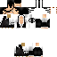

# Kenpachi

*(Kapışma sistemi yazıldı ve simülasyonda test edildi; gerçek oyunda test edilmedi.)*

- **Tür:** İnsan (easy_npc:humanoid, klasik kol). Etiketleri: `korunan`, `kenpachi_npc`.
- **Konum:** -629.5, 68, -437.5 (Drondra Krallığı, Kral Vargoth'un yanı)
- **Krallık:** [Drondra](../kingdoms/drondra.md)
- **Görevi:** Drondra Kralı'nı koruyan; fiziksel kuvvetin ve ham gücün simgesi. Kimseyi kendine denk görmez.
- **Konsept:** Bleach'teki Kenpachi Zaraki'den ilham alınmıştır: savaş düşkünü, kaba, güçle hava atan, zayıfları küçümseyen.
- **İlişkiler:** Kral Vargoth'un koruyucusu.

## Skin / Texture

- **Dosya:** [`assets/npc-skins/kenpachi_v1.png`](../../../assets/npc-skins/kenpachi_v1.png) (64×64, insan, klasik kol). swxff'in verdiği doku eski 64×32 biçimindeydi; vanilla'nın eski-doku dönüşümüyle 64×64'e çevrildi.
- **Oyunda:** `SkinData` `SECURE_REMOTE_URL` ile bu dosyanın GitHub ham adresine bağlı. Kurallar: [assets.md](../../assets.md).

## Diyalog

Karşılama 4 farklı sürümden biri olarak açılır (`kenpachi_hub`, `kenpachi_hub_2..4`; `dv_kenpachi_<n>` etiketi, `npc_cesitlilik.js`). Yanıtlar `kubejs/server_scripts/kenpachi.js`'te rastgele seçilir.

| Düğme | Etiket | Yanıt |
|---|---|---|
| Kralla görüşmek istiyorum | `kenpachi_kral` | 4 küçümseyici yanıttan biri |
| Kimsin sen? | `kenpachi_kim` | 3 tanıtımdan biri |
| Seninle dövüşmek istiyorum | `kenpachi_dovus` | Gece Avcısı değilsen **reiatsu sahnesi** ve küçümseme (hasar yok). **Gece Avcısı (Erwin rütbesi 3) ve üstüysen gerçek kapışma başlar** |

## Kapışma

- **Başlangıç:** Sahne (başlık "KENPACHI ZARAKI", ravager kükremesi, kalp atışı, kırmızı parçacık, "Hazır ol, sinek!"), sonra orijinal Kenpachi gizlenir (yer altına `tp`) ve onun **savaşçı sürümü** doğar. Savaşçı, aynı dokuyla ayrı bir Easy NPC'dir (`kenpachi_fighter` etiketi); canı `300`, zırhı 8, elinde bir cleaver.
- **Hareket ve vuruş (sunucu komutlarıyla):** Script her 2 tikte savaşçıyı oyuncuya doğru yürütür (`tp`, yalnızca yatay), 3,4 blok yakınındayken `damage` komutuyla vurur. **Evre 1:** 7 hasar, 1,5 sn arayla, hız 0,32. **Evre 2** (can yarıdan azsa, "GERÇEK GÜÇ" sahnesi, yakındakilere yavaşlık): 10 hasar, 1 sn arayla, hız 0,44. Ara sıra söz söyler.
- **Bitiş:** Oyuncu ölürse, arenadan (45 blok) kaçarsa, çıkarsa ya da 8 dakika geçerse Kenpachi kazanır ve küçümser (2 dakika bekleme). Oyuncu öldürürse **zafer**: ilk seferde **Nozarashi** kılıcı, sonraki galibiyetlerde 6 zümrüt; 5 dakika bekleme. Aynı anda tek kapışma.
- **Nozarashi:** `knightquest:cleaver` (yoksa netherite kılıç), özel ad ve açıklama, saldırı hasarı **12**, saldırı hızı **0,9** (ağır; netherite kılıç 8 hasar, 1,6 hız), kırılmaz. Bir kez verilir (`kenpachi_kilic`).
- **Güvenlik ağları:** Kapışma yokken artakalan savaşçı silinir ve yer altında kalan orijinal geri getirilir (200 tikte bir); oyun kapanırsa da düzelir.
- **Yönetici:** `/kenpachi_sifirla <oyuncu>` kılıç bayrağını, bekleme ve galibiyet sayısını sıfırlar, süren kapışmayı bitirir.

## Teknik

- NPC: `node tools/yoruichi/gen_kenpachi.js <datapack> <owner-uuid>`, sonra sunucuda `reload` ve `function yoruichi:kenpachi_kur` (yükü çözmek için geçici `forceload`; Owner ve izin seviyesi doğurma anında NBT'ye yazılır). Yalnızca diyalog yenilemek için `KENPACHI_UUID=<npc-uuid>` verip `kenpachi_diyalog` fonksiyonunu kullan.
- İlk kurulumda Owner/izin seviyesi ayrı komutla yazıldığı için yüklenmemiş yığında kaybolmuştu; elle düzeltildi ve üretici artık bunları doğurma NBT'sine koyuyor.
